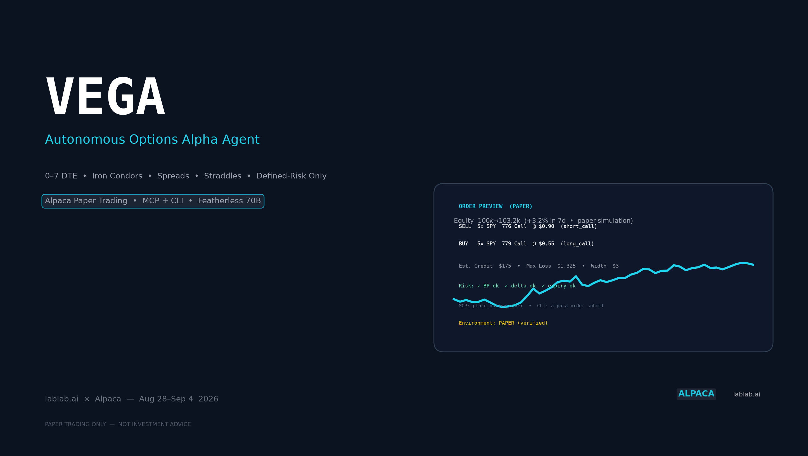
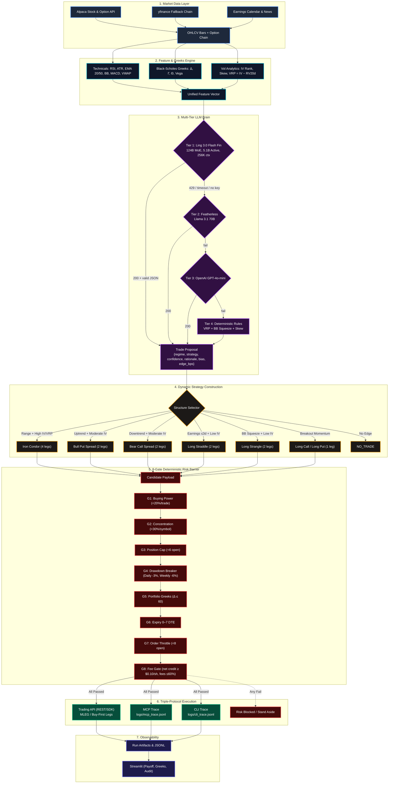
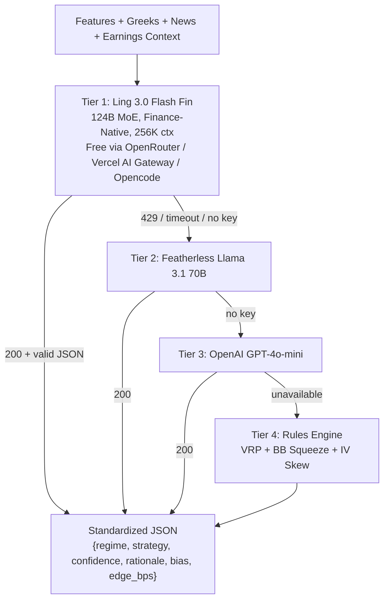
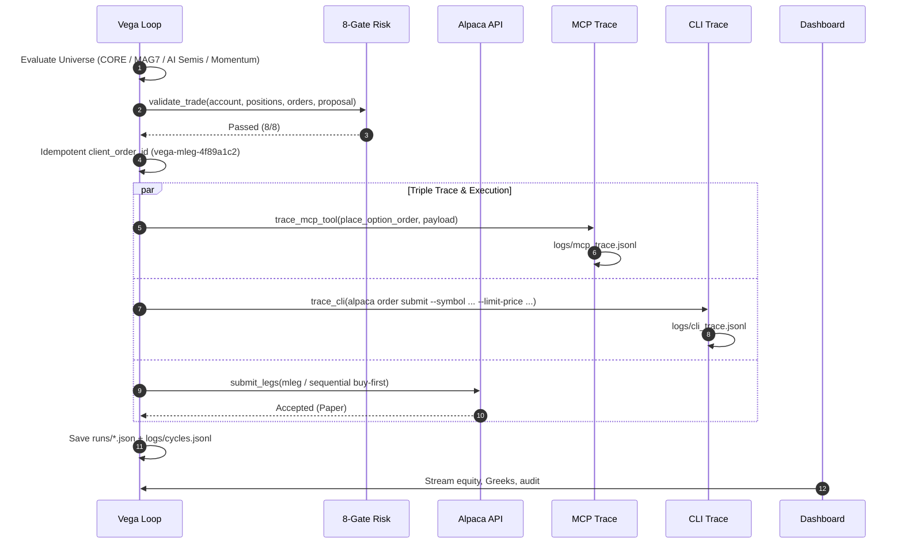
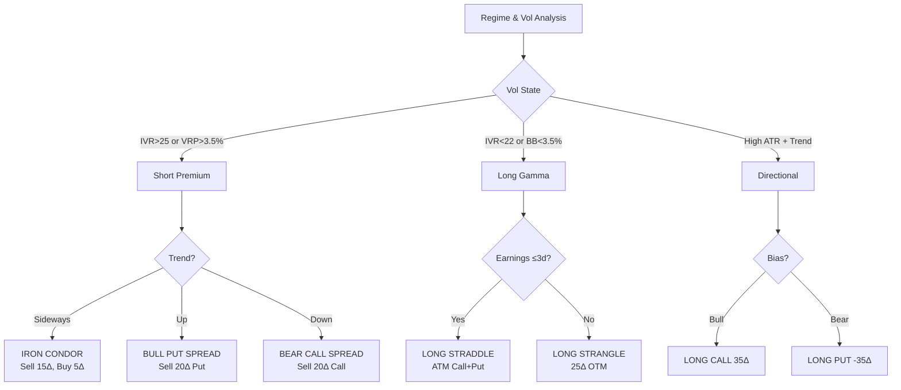
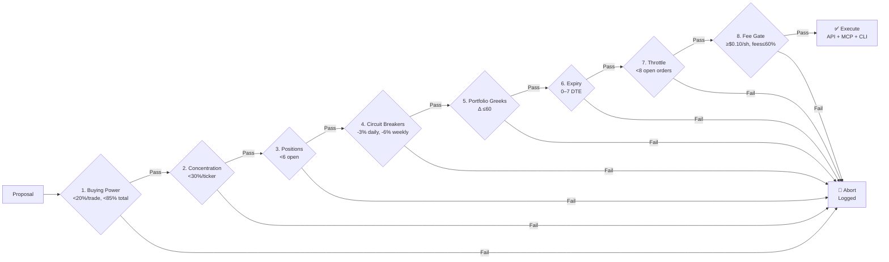

# VEGA — Autonomous Options Alpha Agent

<p align="center">
  
</p>

<p align="center">
  <a href="https://lablab.ai/event/alpaca-ai-trading-agents-hackathon"></a>
  <a href="https://lablab.ai/event/alpaca-ai-trading-agents-hackathon"></a>
  <a href="#mcp--cli-compliance"></a>
  <a href="LICENSE"></a>
</p>

<p align="center">
  
  
  
  
  
  
</p>

<p align="center">
  <strong>Short-horizon 0–7 DTE • Volatility Risk Premium • Black-Scholes Greeks • Iron Condors to Long Straddles</strong><br/>
  <em>Fully autonomous. No naked options. Every order survives 8 deterministic risk gates.</em>
</p>

<p align="center">
  <a href="#-60-second-judge-verification"><strong>⚡ 60s Judge Verification</strong></a> •
  <a href="#-quickstart">Quickstart</a> •
  <a href="#-system-architecture">Architecture</a> •
  <a href="#-quantitative-edge">Quant Edge</a> •
  <a href="#-supported-strategies">Strategies</a> •
  <a href="docs/one_pager.md">One-Pager</a> •
  <a href="QUICKSTART.md">5-min Guide</a>
</p>

---

> **lablab.ai × Alpaca — Alpaca AI Trading Agents Hackathon • Aug 28 – Sep 4 2026**  
> **Track:** *Options Alpha Agents* — autonomous, options-required, paper-only, with MCP + CLI traces.  
> **Team Pantherzz** • Paper account `PA…` ($100k fresh for judging) • Repo: `harshal-sp/alpacaagent`

---

## 📑 Table of Contents

<details>
<summary><strong>Click to expand</strong></summary>

- [60-Second Judge Verification](#-60-second-judge-verification)
- [What is Vega?](#-what-is-vega)
- [Live Demo & Screenshots](#-live-demo--screenshots)
- [System Architecture](#-system-architecture)
- [Quantitative Edge](#-quantitative-edge)
- [Supported Strategies](#-supported-strategies)
- [8-Gate Risk Barrier](#-8-gate-risk-barrier)
- [MCP & CLI Compliance](#-mcp--cli-compliance)
- [Quickstart](#-quickstart)
- [Dashboard](#-dashboard)
- [Project Structure](#-project-structure)
- [Tech Stack](#-tech-stack)
- [Universe & Presets](#-universe--presets)
- [Paper Safety & Hard Guards](#-paper-trading-safety--hard-guards)
- [Hackathon Checklist](#-hackathon-submission-checklist)
- [Disclosure](#-disclosure--disclaimer)

</details>

---

## ⚡ 60-Second Judge Verification

Copy-paste this — no guesswork:

```bash
# 1) Clone & install (60s)
git clone https://github.com/harshal-sp/alpacaagent.git && cd alpacaagent
python -m venv .venv && source .venv/bin/activate
pip install -r requirements.txt

# 2) Configure paper keys (from https://app.alpaca.markets/paper/dashboard/overview)
cp .env.example .env && nano .env   # set APCA_API_KEY_ID / APCA_API_SECRET_KEY / APCA_PAPER=true

# 3) Prove autonomy + traces (no order submitted)
.venv/bin/python -m src.agent --dry-run --force
cat logs/mcp_trace.jsonl | head -5    # MCP evidence: GetDynamicTools + place_option_order
cat logs/cli_trace.jsonl | head -5    # CLI evidence: alpaca order submit --dry-run
cat logs/cycles.jsonl | tail -1 | jq  # full cycle JSON with features, decision, risk reasons

# 4) Launch dashboard (optional)
.venv/bin/streamlit run src/dashboard/app.py  # → http://localhost:8501
```

**What judges see in logs:**

| File | Proves | Example |
|------|--------|---------|
| `logs/mcp_trace.jsonl` | MCP tool discovery + order via `alpaca-paper-trading` namespace | `{"tool":"GetDynamicTools","pattern":"alpaca"} → {"tool":"place_option_order","symbol":"SPY..."} ` |
| `logs/cli_trace.jsonl` | Byte-identical CLI commands | `alpaca order submit --symbol NVDA260904C00125000 --side buy --qty 2 --type limit --limit-price 3.45 --time-in-force day --client-order-id vega-… --dry-run` |
| `runs/*.json` | Full cycle audit | `features, decision{regime, strategy, confidence, rationale}, proposal{legs,greeks,fees}, risk_reasons` |
| `logs/cycles.jsonl` | Append-only history for dashboard equity curve | One JSON per cycle |

> Fresh **$100k judging account** required: Alpaca Dashboard → Paper Trading → Create New Account → $100,000 → copy `APCA_API_KEY_ID/SECRET` → paste Account ID `PA…` into lablab submission.

---

## 🧠 What is Vega?

**Vega** is an autonomous options quant that trades only **0–7 DTE defined-risk structures** on the most liquid, high-momentum names:

`SPY` `QQQ` `IWM` `SMH` `NVDA` `AAPL` `MSFT` `AMZN` `GOOGL` `META` `TSLA` `AMD` `PLTR` `AVGO` `COIN` `NFLX` (+ presets)

**Pipeline in one line:**

```
Alpaca Data API → Feature & Greeks Engine → Ling 3.0 Flash Fin (124B MoE) → Strategy Selector → 8 Risk Gates → Execution (API + MCP + CLI) → Streamlit Dashboard
```

**Why it wins a 7-day hackathon window:**

- **Income + convexity balanced** — harvests theta (iron condors / credit spreads) when VRP is high, switches to cheap gamma (straddles/strangles) into squeezes or earnings, while staying defined-risk.
- **Finance-native brain** — 124B MoE Ling Flash Fin tuned on FinFIRST/FinanceAgent understands earnings catalysts, IV rank, and skew without prompt hacks.
- **Deterministic safety** — LLM proposes, *math disposes*: 8 gates block any order that fails buying-power, concentration, delta, DTE, or fee survival.
- **Full auditability** — every decision logs `features → decision → proposal → risk_reasons → order_results` with synchronized MCP + CLI traces (both implemented for max Technology score).

---

## 🎬 Live Demo & Screenshots

| Dashboard — Overview | Greeks Payoff Visualizer | MCP/CLI Evidence |
|---|---|---|
| Equity curve, regime snapshot (IV rank/VRP/BB width), agent status | Interactive Plotly expiration payoff for any symbol/strategy | Live tables of `mcp_trace.jsonl` + `cli_trace.jsonl` for judges |
| `http://localhost:8501` tab **Overview** | Tab **Greeks & Strategy** | Tab **Logs (MCP/CLI)** |

<p align="center">
  <em>Cover: <code>cover.png</code> (1600×900) + dashboard screenshot → Figma/Canva overlay → export for lablab submission. Generate with <code>python scripts/generate_cover.py</code> if present.</em>
</p>

<details>
<summary><strong>▶ Demo video script (2–3 min)</strong></summary>

1. **0:00–0:20** — Intro: "Vega, autonomous 0–7 DTE options agent, Alpaca paper-only, MCP+CLI."
2. **0:20–0:50** — Run `.venv/bin/python -m src.agent --dry-run --force` — show banner, feature logs, LLM decision JSON, preview table with fees, `DRY RUN — no orders submitted`.
3. **0:50–1:20** — `cat logs/mcp_trace.jsonl` + `cat logs/cli_trace.jsonl` — highlight `GetDynamicTools` and `alpaca order submit` lines.
4. **1:20–1:50** — `streamlit run src/dashboard/app.py` — Overview equity, Cycles & Trades, Greeks payoff (switch SPY iron condor → NVDA straddle), Logs tab.
5. **1:50–2:30** — Explain 8 gates + defined-risk payoff (wing width − credit or premium = max loss).
6. **2:30–3:00** — Fresh $100k account + live `python -m src.agent --force` (if market open) or cron `*/15 9-16 * * 1-5`.

</details>

---

## 📐 System Architecture

### End-to-End Autonomous Loop



### LLM Fallback Hierarchy



### Execution Lifecycle (API + MCP + CLI in parallel)



---

## 📊 Quantitative Edge

### 1. Volatility Risk Premium (VRP) & Skew

$$\text{VRP} = \text{IV}_{\text{annualized}} - \text{RV}_{20\text{d annualized}}$$
$$\text{Skew Ratio} = \frac{\text{IV}_{\text{OTM Put (25}\Delta\text{)}}}{\text{IV}_{\text{OTM Call (25}\Delta\text{)}}}$$

- **VRP > +3.5%** → market overpays for tail risk → edge in **selling** credit spreads / iron condors.
- **VRP < +1.0% + BB<sub>width</sub> < 3.5%** (squeeze) → IV underpriced → edge in **buying** gamma (straddles/strangles).

> Computed in `src/features/indicators.py` from 20-day realized vol vs chain mid IV.

### 2. Black-Scholes Greeks (continuous-yield)

$$\Delta = e^{-qT} N(d_1)\quad (\text{Call}),\quad \Delta = e^{-qT}(N(d_1)-1)\quad (\text{Put})$$
$$\Gamma = \frac{e^{-qT}\phi(d_1)}{S\sigma\sqrt{T}},\quad \Theta = -\frac{Se^{-qT}\phi(d_1)\sigma}{2\sqrt{T}} - rKe^{-rT}N(d_2),\quad \nu = \frac{Se^{-qT}\phi(d_1)\sqrt{T}}{100}$$

Every strike mapped in `src/features/greeks.py` with dividend yield `q` and risk-free `r`.

### 3. Realistic Friction Model (paper → live gap)

Paper shows $0 commission and perfect mids. Vega pre-filters drag:

$$\text{Fees} = 2 \times \left(\sum_{\text{legs}} (\text{Comm}+\text{Reg})\times \text{Qty} + \text{Notional}\times 0.0005\right)$$

- **Commission:** $0.15 / contract / leg
- **Regulatory (OCC/ORF):** $0.02 / contract
- **Slippage:** 5 bps on gross notional
- **Fee Gate:** reject if `net credit < $0.10/share` or `fees > 60%` of gross credit (`src/utils/fees.py`).

---

## 🛠 Supported Strategies

| Strategy | Legs | Delta Wing | Condition | Max Profit | Max Loss |
|---|:---:|---|---|---|---|
| **Iron Condor** | 4: Short Put Spread + Short Call Spread | 15Δ short / 5Δ long | High IV, sideways (`VRP>3.5%`) | Net credit | Wing width − credit |
| **Bull Put Spread** | 2: Sell OTM Put + Buy lower Put | 20Δ short / 7Δ long | Uptrend, mod/high IV | Net credit | Width − credit |
| **Bear Call Spread** | 2: Sell OTM Call + Buy higher Call | 20Δ short / 7Δ long | Downtrend, mod/high IV | Net credit | Width − credit |
| **Long Straddle** | 2: Buy ATM Call + Buy ATM Put | 50Δ / −50Δ | Low IV, earnings ≤3d | Unlimited | Debit |
| **Long Strangle** | 2: Buy OTM Call + Buy OTM Put | 25Δ / −25Δ | Squeeze, low IV | Unlimited | Debit |
| **Long Call** | 1: Buy OTM Call | 35Δ | Bullish breakout | Unlimited | Debit |
| **Long Put** | 1: Buy OTM Put | −35Δ | Bearish breakdown | Strike − premium | Debit |

> All structures are **defined-risk** — max loss known at entry. No naked shorts. See `src/strategy/selector.py` for Delta-aware sizing (max 5 contracts/leg).

<details>
<summary><strong>▶ Strategy decision matrix</strong></summary>



</details>

---

## 🛡 8-Gate Risk Barrier

No order reaches Alpaca without passing **all 8** (`src/risk/gates.py:validate_trade`):



- **Automated exits** each cycle: take-profit **+40%**, stop-loss **−25%** (`src/execution/orders.py:manage_positions`).
- **Diversification boost:** down-weights same-underlying proposals when ≥2 positions exist.
- **Double gate:** re-validates best proposal immediately before submit.

---

## 🏆 MCP & CLI Compliance

Vega implements **both** protocols for maximum Technology score — judges can verify either.

### MCP Server

- **Config:** `config/mcp.json.example` (`uvx alpaca-mcp-server`, `ALPACA_PAPER_TRADE=true`)
- **Discovery:** `GetDynamicTools(pattern="alpaca")` → `place_option_order`, `get_account_info`, `get_all_positions`, `close_position`, …
- **Evidence:** `logs/mcp_trace.jsonl` (namespace `alpaca-paper-trading`, params, result, timestamp per call — matches Alpaca MCP Skills spec)

### Alpaca CLI

- **Zero-drift commands:** every preview emits byte-identical CLI:
  ```bash
  alpaca order submit --symbol NVDA260904C00125000 --side buy --qty 2 --type limit --limit-price 3.45 --time-in-force day --client-order-id vega-9a8b7c6d --dry-run
  alpaca doctor   # verifies https://paper-api.alpaca.markets
  alpaca account get
  ```
- **Evidence:** `logs/cli_trace.jsonl` + idempotent `client_order_id` (`vega-{uuid4[:8]}`) avoids duplicate fills.

> See also: `docs/opencode_ling.md` for Ling via Opencode proxy (no user key needed inside `opencode run`).

---

## 🚀 Quickstart

### 1) Install

```bash
git clone https://github.com/harshal-sp/alpacaagent.git && cd alpacaagent
python -m venv .venv && source .venv/bin/activate
pip install -r requirements.txt
```

### 2) Configure (paper only)

```bash
cp .env.example .env
# Edit .env — paper keys from https://app.alpaca.markets/paper/dashboard/overview
```

```ini
# .env — keep APCA_PAPER=true (hard guard in src/config.py)
APCA_API_KEY_ID=PK********************
APCA_API_SECRET_KEY=****************************************
APCA_PAPER=true

# Ling 3.0 Flash Fin — free through Sep 25 2026
OPENROUTER_API_KEY=sk-or-v1-****************************************
LING_MODEL=inclusionai/ling-3.0-flash-fin:free
# or: AI_GATEWAY_API_KEY / LING_API_KEY

# Optional fallbacks
FEATHERLESS_API_KEY=
OPENAI_API_KEY=

# Universe: CORE (16) | MAG_SEVEN | TECH | AI_AND_SEMIS | HIGH_BETA_MOMENTUM | INDEX_ETFS | ALL
# or custom: TRADING_UNIVERSE=SPY,QQQ,NVDA,AAPL,PLTR,AVGO,COIN
TRADING_UNIVERSE=CORE
```

### 3) Run

```bash
# Dry-run: evaluates universe, Greeks, risk gates, previews orders — no submit
.venv/bin/python -m src.agent --dry-run --force

# Live paper: enforces 8 gates and submits paper orders
.venv/bin/python -m src.agent --force

# Single ticker
.venv/bin/python -m src.agent --dry-run --force --symbol NVDA

# Autonomous loop (15 min)
.venv/bin/python -m src.agent --loop --interval 900

# One-shot via Opencode proxy (Ling without your own key)
opencode run -m opencode/ling-3.0-flash-fin-free "python -m src.agent --dry-run --force"
```

### 4) Dashboard

```bash
.venv/bin/streamlit run src/dashboard/app.py
# → http://localhost:8501
```

Tabs: **Overview** (equity, IV rank, regime) • **Cycles & Trades** (full history) • **Greeks & Payoff** (Plotly profiles + chain explorer) • **Logs (MCP/CLI)** (judging evidence) • **About**

<details>
<summary><strong>▶ VPS / 24-7 autonomy</strong></summary>

```bash
# Fast VPS setup (Ubuntu/Debian)
bash scripts/deploy_vps.sh

# tmux
tmux new -s vega ".venv/bin/python -m src.agent --loop --interval 900"
# detach: Ctrl+B, D  |  attach: tmux attach -t vega

# cron (market hours only, 15m)
chmod +x src/jobs/cron.sh
crontab -e
# */15 9-16 * * 1-5 /path/to/alpacaagent/src/jobs/cron.sh >> /path/to/alpacaagent/logs/cron.log 2>&1
```

</details>

<details>
<summary><strong>▶ Troubleshooting</strong></summary>

| Error | Cause | Fix |
|---|---|---|
| `403 Forbidden` | Insufficient buying power | Lower `max_buying_power_pct_per_trade` in `src/config.py` or reduce `max_contracts_per_leg` |
| `422 Unprocessable` | Wrong TIF/symbol format for options | Options require `time_in_force=day` (see `src/execution/orders.py`) |
| `401 Unauthorized` | Wrong keys or live keys | Regenerate **paper** keys, ensure `APCA_PAPER=true` |
| `No option chain` | yfinance throttle / illiquid expiry | Wait 30s — agent falls back to synthetic scored chain |
| `Market closed` | Outside 9:30–16:00 ET | Use `--force` for dry-run, or `--loop` during market hours |

</details>

---

## 📁 Project Structure

```
alpacaagent/
├── src/
│   ├── agent.py                 # main loop — run_cycle(), banner, _save_cycle()
│   ├── config.py                # universe presets, risk/fee/execution constants
│   ├── brain/llm.py             # Ling → Featherless → OpenAI → rules classifier
│   ├── data/
│   │   ├── alpaca_client.py     # TradingClient(paper=True) + Stock/Option clients + yfinance fallback
│   │   ├── earnings.py          # earnings calendar (ETFs skipped)
│   │   └── news.py              # headline sentiment (Ling classifier + heuristic)
│   ├── features/
│   │   ├── indicators.py        # RSI, ATR, EMA, BB width/pct_B, MACD, VWAP, VRP, skew
│   │   └── greeks.py            # Black-Scholes Δ/Γ/Θ/Vega per strike
│   ├── strategy/selector.py     # 8 structures → concrete legs + Delta sizing
│   ├── risk/gates.py            # 8 gates validate_trade()
│   ├── execution/
│   │   ├── orders.py            # preview(), submit_legs(), manage_positions() (+40%/-25%)
│   │   └── mcp_trace.py         # MCP + CLI audit loggers
│   ├── utils/
│   │   ├── fees.py              # commission + reg + slippage, fee gate
│   │   ├── logger.py            # rich + JSONL
│   │   └── market_hours.py      # is_market_open() ET
│   ├── dashboard/app.py         # Streamlit: equity, regime, payoff, logs
│   └── jobs/
│       ├── cron.sh              # cron wrapper
│       └── scheduler.py         # interval helper
├── config/mcp.json.example      # uvx alpaca-mcp-server config
├── docs/
│   ├── one_pager.md             # 1-page judging writeup
│   ├── opencode_ling.md         # Ling via Opencode guide
│   ├── slides.md & social_posts.md
│   └── COVER.md                 # cover brief
├── scripts/
│   ├── deploy_vps.sh            # fast VPS setup
│   └── generate_cover.py
├── tests/test_universe.py       # universe / presets / legs
├── logs/
│   ├── mcp_trace.jsonl          # ✅ judging evidence (kept in git)
│   ├── cli_trace.jsonl          # ✅ judging evidence (kept in git)
│   ├── vega.jsonl / vega.log    # (gitignored)
│   └── cycles.jsonl             # (gitignored, dashboard source)
├── runs/*.json                  # (gitignored) per-cycle artifacts
├── cover.png                    # 1600×900 submission cover
├── pyproject.toml & requirements.txt
└── README.md & QUICKSTART.md
```

---

## 🧩 Tech Stack

| Layer | Choice | Why |
|---|---|---|
| **Market Data** | `alpaca-py` (Trading + Stock/Option Historical) + `yfinance` fallback | Paper-only `paper=True` literal, scored chain selection (≥5 calls & puts) |
| **Quant** | `numpy` `pandas` `scipy` — Black-Scholes, RSI/ATR/EMA/BB/MACD/VWAP | VRP + squeeze detection without extra deps |
| **Brain** | **Ling 3.0 Flash Fin** 124B MoE (5.1B active, 256K, FinFIRST/FinanceAgent-tuned) → Featherless Llama 3.1 70B → GPT-4o-mini → rules | Finance-native JSON `{regime, strategy, confidence, rationale, bias, edge_bps}` |
| **Risk** | 8 deterministic gates + fee model ($0.15 + $0.02 + 5 bps) | LLM proposes, math disposes |
| **Execution** | Trading API `mleg` + buy-first sequential fallback, idempotent `client_order_id` | Avoids 403 naked uncovered |
| **Observability** | `rich` logs + JSONL + `Streamlit` + `Plotly` payoff | Equity, Greeks, audit in one UI |
| **MCP/CLI** | `uvx alpaca-mcp-server` + `alpaca` CLI | Both implemented, both traced |
| **Deploy** | `systemd`/`tmux`/`cron` + `scripts/deploy_vps.sh` | 15-min loop 9:30–16:00 ET |

---

## 🌌 Universe & Presets

| Preset | Symbols | Use |
|---|---|---|
| `CORE` **(default, 16)** | `SPY` `QQQ` `IWM` `SMH` `AAPL` `NVDA` `MSFT` `AMZN` `GOOGL` `META` `TSLA` `AMD` `PLTR` `AVGO` `COIN` `NFLX` | Balanced high-liquidity + high-beta |
| `MAG_SEVEN` | `AAPL` `NVDA` `MSFT` `AMZN` `GOOGL` `META` `TSLA` | Mega-cap |
| `AI_AND_SEMIS` | `NVDA` `AMD` `AVGO` `TSM` `MU` `ARM` | AI infrastructure |
| `HIGH_BETA_MOMENTUM` | `PLTR` `COIN` `NFLX` `UBER` `CRM` | Momentum |
| `INDEX_ETFS` | `SPY` `QQQ` `IWM` `SMH` | Index hedges |
| `TECH` | `QQQ` + all tech semis | Tech tilt |
| `ALL` | Deduped union + `DELL` `HPQ` | Max breadth |

Set via `.env`: `TRADING_UNIVERSE=CORE` or `TRADING_UNIVERSE=SPY,QQQ,NVDA,AAPL` — parsed in `src/config.py:parse_universe()`.

Earnings watch (`src/data/earnings.py`) auto-skips ETFs (`SPY/QQQ/IWM/SMH`) — only single-name catalysts trigger straddles.

---

## 🛡 Paper Trading Safety & Hard Guards

- **Literal guard:** `AlpacaClient(paper=True)` — hardcoded, not env-toggled.
- **`AlpacaPaperGuard`:** validates `APCA_PAPER=true` before every account/position/order call (`src/data/alpaca_client.py`).
- **No naked exposure:** every structure has defined wings; max loss computed before entry.
- **Auto exits:** `manage_positions` closes at **+40%** take-profit / **−25%** stop-loss.
- **Circuit breakers:** daily **−3%**, weekly **−6%** halt (Gate 4).
- **Idempotency:** `vega-{uuid4}` `client_order_id` prevents double fills on retry.

---

## 📋 Hackathon Submission Checklist

- [x] **Public GitHub** — MIT License (`LICENSE`)
- [x] **Autonomous agent** — `src/agent.py` + 15-min loop (`--loop` / `cron.sh`)
- [x] **Options Alpha track** — 8 defined-risk structures (condor, spreads, straddle, strangle, directional)
- [x] **Technology — both** — Alpaca Trading API + MCP (`logs/mcp_trace.jsonl`) + CLI (`logs/cli_trace.jsonl`)
- [x] **LLM intelligence** — Ling 3.0 Flash Fin 124B MoE + 3 fallbacks + Opencode proxy (`opencode.jsonc`)
- [x] **Observability** — Streamlit + Plotly payoff + Greeks + audit
- [x] **Docs** — `README.md`, `docs/one_pager.md`, `docs/opencode_ling.md`, `QUICKSTART.md`, `COVER.md`
- [x] **Tests** — `tests/test_universe.py` (`pytest`)
- [ ] **Judging account** — fresh $100k paper `PA…` for final review
- [ ] **Demo video** — 2–3 min walkthrough (dry-run + dashboard)
- [ ] **Cover image** — `cover.png` 1600×900

---

## ⚖️ Disclosure & Disclaimer

> **For informational, educational, and research purposes only.** Not investment advice, recommendation, offer, or solicitation to buy/sell securities or options. Options involve substantial risk and are not suitable for every investor — you can lose your entire premium on longs. Paper trading simulates execution and may not reflect real slippage, liquidity, or latency. Review [Alpaca Disclosures](https://alpaca.markets/disclosures) before trading. **PAPER TRADING ONLY — NO REAL MONEY.**

---

## 📄 License

MIT — see [`LICENSE`](LICENSE).

<p align="center">
  <strong>Built with precision for the Alpaca AI Trading Agents Hackathon</strong><br/>
  <em>lablab.ai × Alpaca — Aug 28 – Sep 4 2026 • Team Pantherzz — Options Alpha</em>
</p>

<p align="center">
  <a href="https://lablab.ai/event/alpaca-ai-trading-agents-hackathon">lablab.ai</a> •
  <a href="https://alpaca.markets">Alpaca</a> •
  <a href="https://openrouter.ai/models/inclusionai/ling-3.0-flash-fin:free">Ling 3.0 Flash Fin</a> •
  <a href="https://api.featherless.ai">Featherless</a>
</p>
