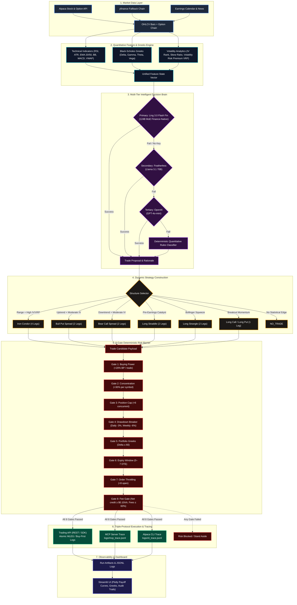
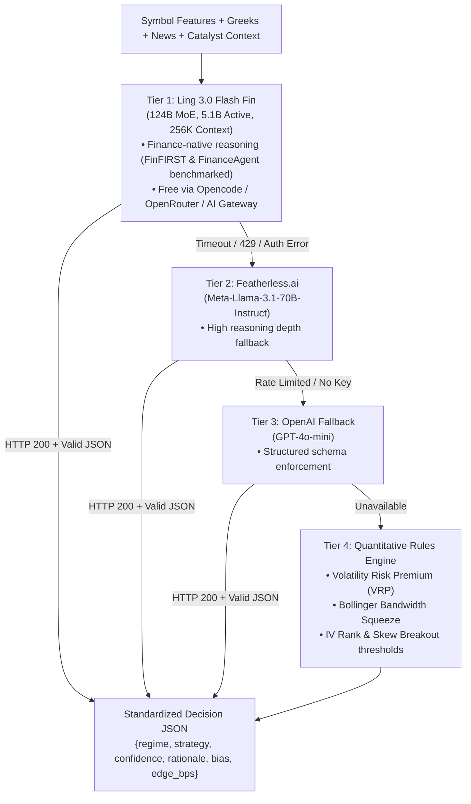
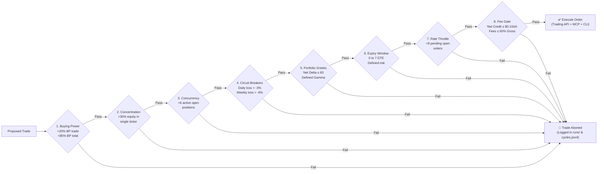
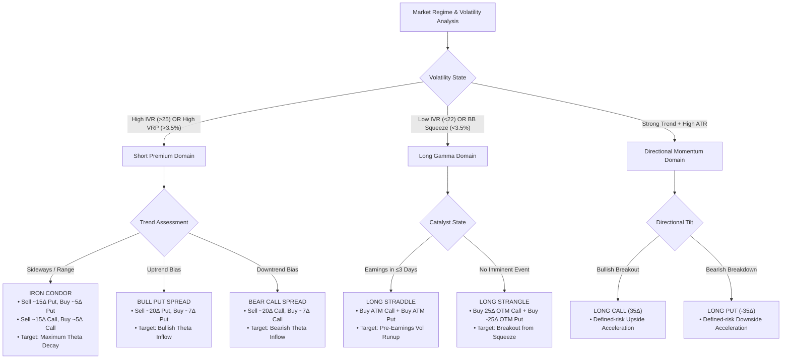
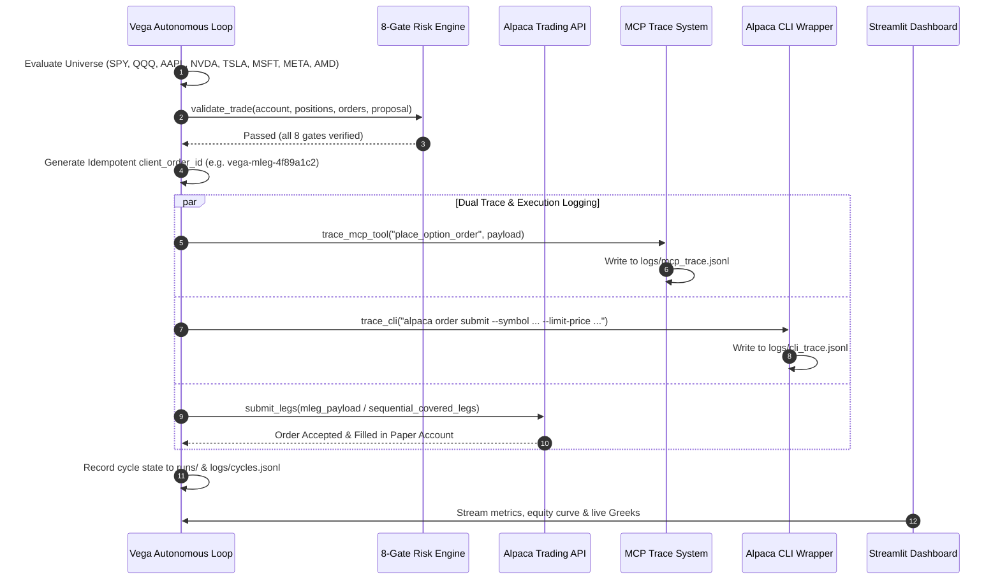

# Vega — Autonomous Options Alpha Agent

[](https://lablab.ai/event/alpaca-ai-trading-agents-hackathon)
[](https://lablab.ai/event/alpaca-ai-trading-agents-hackathon)
[-purple?style=for-the-badge)](https://openrouter.ai/models/inclusionai/ling-3.0-flash-fin:free)
[](https://alpaca.markets)
[](#mcp--cli-compliance)
[](LICENSE)

> **Alpaca AI Trading Agents Hackathon — lablab.ai × Alpaca — Aug 28–Sep 4 2026**  
> **Track:** *Options Alpha Agents* — Fully autonomous, options-required, paper-only trading, implementing both MCP tool discovery and CLI execution traces.

---

## ⚡ Executive Summary

**Vega** is a high-performance, autonomous options quantitative trading agent designed specifically for short-horizon **0–7 DTE defined-risk structures** on high-liquidity underlyings (`SPY`, `QQQ`, `AAPL`, `NVDA`, `TSLA`, `MSFT`, `META`, `AMD`). 

Vega combines quantitative volatility modeling (**Volatility Risk Premium (VRP)**, **Black-Scholes Greeks**, **Bollinger Squeeze detection**, and **IV Skew**) with a finance-native **124B MoE LLM (Ling 3.0 Flash Fin)**. It systematically selects between **8 defined-risk options strategies**, evaluates proposals through an uncompromising **8-Gate Deterministic Risk Barrier** (including realistic commissions, regulatory fees, and slippage gating), and submits orders via **Alpaca Trading API** with synchronized **MCP Server** and **CLI** audit traces.

```
Alpaca Data API ──► Feature & Greeks Engine ──► Ling Fin Flash LLM Brain ──► Strategy Selector ──► 8 Deterministic Risk Gates ──► Order Execution (API + MCP + CLI) ──► Real-Time Dashboard
```

---

## 📐 System Architecture

### 1. End-to-End Autonomous Trading Pipeline



---

### 2. Multi-Tier LLM Fallback Hierarchy

Vega is resilient against API rate limits, network outages, and credential changes through a 4-tier hierarchical brain:



---

### 3. The 8-Gate Deterministic Risk Barrier

No order reaches Alpaca Paper without strictly satisfying all 8 deterministic checkpoints:



---

### 4. Strategy Selection Decision Matrix



---

### 5. Execution & Trace Lifecycle (API + MCP + CLI)



---

## 📊 Quantitative Mechanics & Financial Edge

### 1. Volatility Risk Premium (VRP) & Skew
Vega quantifies the structural mispricing between implied and realized volatility:
$$\text{VRP} = \text{IV}_{\text{annualized}} - \text{RV}_{20\text{d annualized}}$$
$$\text{Skew Ratio} = \frac{\text{IV}_{\text{OTM Put (25}\Delta\text{)}}}{\text{IV}_{\text{OTM Call (25}\Delta\text{)}}}$$
- **$\text{VRP} > +3.5\%$:** Markets are overpaying for tail risk $\rightarrow$ Edge in selling defined-risk credit spreads & iron condors.
- **$\text{VRP} < +1.0\%$ with Bollinger Squeeze ($BB_{\text{width}} < 3.5\%$):** Implied volatility is underpriced $\rightarrow$ Edge in buying long gamma (straddles/strangles).

### 2. Black-Scholes Greeks Engine
Every strike in the universe is mapped in real-time with continuous yield Black-Scholes pricing:
$$\Delta = e^{-q T} N(d_1) \quad (\text{Call}), \quad \Delta = e^{-q T} (N(d_1) - 1) \quad (\text{Put})$$
$$\Gamma = \frac{e^{-q T} \phi(d_1)}{S \sigma \sqrt{T}}, \quad \Theta = -\frac{S e^{-q T} \phi(d_1) \sigma}{2 \sqrt{T}} - r K e^{-r T} N(d_2), \quad \nu = \frac{S e^{-q T} \phi(d_1) \sqrt{T}}{100}$$

### 3. Realistic Friction & Fee Model
Paper trading accounts typically model $0 commission and perfect mid fills. Vega bridges the paper-to-live performance gap by calculating transaction drag before every entry:
$$\text{Fees}_{\text{Total}} = 2 \times \left( \sum_{\text{legs}} (\text{Comm} + \text{Reg}) \times \text{Qty} + \text{Notional} \times 0.0005 \right)$$
- **Commission:** $\$0.15$ / contract / leg
- **Regulatory (OCC / ORF):** $\$0.02$ / contract
- **Modeled Slippage:** $5\text{ bps}$ ($0.05\%$) on gross notional
- **Fee Gate:** If $\text{Net Credit} < \$0.10/\text{share}$ or $\text{Fees} > 60\%$ of gross credit, the trade is rejected.

---

## 🛠 Supported Options Strategies

| Strategy | Legs & Structure | Delta Wing Target | Market Condition | Max Profit | Max Loss |
| :--- | :--- | :--- | :--- | :--- | :--- |
| **Iron Condor** | 4 legs: Short Put Spread + Short Call Spread | $15\Delta$ Short / $5\Delta$ Long | High IV, Sideways ($VRP > 3.5\%$) | Net Credit Collected | Wing Width $-$ Net Credit |
| **Bull Put Spread** | 2 legs: Sell OTM Put + Buy Lower Put | $20\Delta$ Short / $7\Delta$ Long | Uptrend, Moderate/High IV | Net Credit Collected | Strike Width $-$ Net Credit |
| **Bear Call Spread** | 2 legs: Sell OTM Call + Buy Higher Call | $20\Delta$ Short / $7\Delta$ Long | Downtrend, Moderate/High IV | Net Credit Collected | Strike Width $-$ Net Credit |
| **Long Straddle** | 2 legs: Buy ATM Call + Buy ATM Put | $50\Delta$ Call / $-50\Delta$ Put | Low IV, Earnings Catalyst $\le 3\text{d}$ | Unlimited | Total Debit Paid |
| **Long Strangle** | 2 legs: Buy OTM Call + Buy OTM Put | $25\Delta$ Call / $-25\Delta$ Put | Bollinger Squeeze, Low IV | Unlimited | Total Debit Paid |
| **Long Call** | 1 leg: Buy Directional OTM Call | $35\Delta$ Call | Strong Bullish Breakout | Unlimited | Total Debit Paid |
| **Long Put** | 1 leg: Buy Directional OTM Put | $-35\Delta$ Put | Strong Bearish Breakdown | Strike $-$ Premium | Total Debit Paid |

---

## 🏆 MCP & CLI Compliance (Hackathon Technology Requirements)

Vega implements **both** the Model Context Protocol (MCP) and Alpaca CLI execution pathways for maximum Technology scoring.

### 1. Model Context Protocol (MCP) Server
- **Configuration:** `config/mcp.json.example` (`uvx alpaca-mcp-server` with `ALPACA_PAPER_TRADE=true`).
- **Dynamic Tool Discovery:** Agent executes `GetDynamicTools` at initialization to discover tools (`place_option_order`, `get_account_info`, `get_all_positions`, `close_position`, etc.).
- **Audit Logging:** Every tool call and response is recorded in `logs/mcp_trace.jsonl` matching the Alpaca MCP Skills specification.

### 2. Alpaca CLI Integration
- **Zero-Drift Command Generation:** Every preview produces byte-identical CLI execution commands:
  ```bash
  alpaca order submit --symbol NVDA260904C00125000 --side buy --qty 2 --type limit --limit-price 3.45 --time-in-force day --client-order-id vega-9a8b7c6d --dry-run
  ```
- **Endpoint Verification:** Verifies `alpaca doctor` points to `https://paper-api.alpaca.markets`.
- **Audit Logging:** All CLI invocations recorded in `logs/cli_trace.jsonl`.

---

## 🚀 Quickstart Guide

### 1. Clone & Setup Environment

```bash
# Clone the repository
git clone <your-repo-url> && cd lablabai

# Create and activate virtual environment
python -m venv .venv
source .venv/bin/activate

# Install dependencies
pip install -r requirements.txt
```

### 2. Configure Credentials

Copy the environment template:
```bash
cp .env.example .env
```

Edit `.env` with your Alpaca **PAPER** keys (ensure `APCA_PAPER=true`):
```ini
# Alpaca Paper Keys (from https://app.alpaca.markets/paper/dashboard/overview)
APCA_API_KEY_ID=PK********************
APCA_API_SECRET_KEY=****************************************
APCA_PAPER=true

# Ling 3.0 Flash Fin LLM (Free through Sep 25 2026)
OPENROUTER_API_KEY=sk-or-v1-****************************************
LING_MODEL=inclusionai/ling-3.0-flash-fin:free

# Optional Fallback LLMs
FEATHERLESS_API_KEY=
OPENAI_API_KEY=
```

### 3. Run Autonomous Cycle

```bash
# Dry-run cycle: evaluates universe, calculates Greeks, runs risk gates, previews orders without submitting
.venv/bin/python -m src.agent --dry-run --force

# Live paper cycle: evaluates market, enforces 8 risk gates, and submits paper orders
.venv/bin/python -m src.agent --force

# Run specific single ticker evaluation
.venv/bin/python -m src.agent --dry-run --force --symbol NVDA

# Autonomous 15-minute scheduled loop
.venv/bin/python -m src.agent --loop --interval 900
```

### 4. Launch Real-Time Dashboard

```bash
.venv/bin/streamlit run src/dashboard/app.py
```
Open **`http://localhost:8501`** in your browser to view:
- **Overview:** Paper account metrics, equity curve, universe regime snapshot with VRP & IV skew.
- **Cycles & Trades:** Full historical log of all cycles and decisions.
- **Greeks & Payoff Visualizer:** Interactive Plotly payoff profiles and live chain Greeks explorer.
- **Logs (MCP/CLI):** Live evidence viewer for hackathon judges showing MCP and CLI traces.

---

## 🛡 Paper Trading Safety & Hard Guards

- **Hard-Coded Literal:** `AlpacaClient(paper=True)` enforces `paper=True` as a code literal, not an easily misconfigured environment toggle.
- **`AlpacaPaperGuard`:** Validates `APCA_PAPER=true` before every account, position, and order operation.
- **Automated P&L Exits:** `OrderExecutor.manage_positions` automatically triggers take-profit at `+40%` and stop-loss at `-25%`.
- **Zero Naked Exposure:** All strategies enforce defined-risk wings.

---

## 📋 Hackathon Submission Checklist

- [x] **Public GitHub Repo** with MIT License
- [x] **Autonomous Agent Implementation** (`src/agent.py`) with 8 deterministic risk gates
- [x] **Options Alpha Track Requirements:** Defined-risk options structures (Iron Condor, Spreads, Straddles, Strangles, Directional)
- [x] **Technology Score (Both Implemented):** Alpaca Trading API + MCP Server + CLI Traces
- [x] **LLM Intelligence:** Finance-native Ling 3.0 Flash Fin MoE + Multi-tier fallbacks
- [x] **Observability:** Streamlit Dashboard with Plotly strategy payoff diagrams and live Greeks
- [x] **Documentation:** `README.md`, `docs/one_pager.md`, `docs/opencode_ling.md`
- [ ] **Judging Account:** Fresh $100k paper account generated for final judging review
- [ ] **Demo Video:** 2–3 min walkthrough of autonomous dry-run cycle & dashboard

---

## ⚖️ Disclosure & Disclaimer

> This repository is for **informational, educational, and research purposes only**. It is not investment advice, a recommendation, offer, or solicitation to buy or sell securities, options, or other financial instruments. Trading options involves substantial risk of loss and is not suitable for every investor. Paper trading simulates order execution and may not reflect real-market slippage, liquidity constraints, or execution latency. Please review [Alpaca's Disclosures](https://alpaca.markets/disclosures) before trading.

---

## 📄 License

Distributed under the **MIT License**. See [`LICENSE`](LICENSE) for more information.

*Built with precision for the Alpaca AI Trading Agents Hackathon — lablab.ai × Alpaca — Aug 28–Sep 4 2026.*
